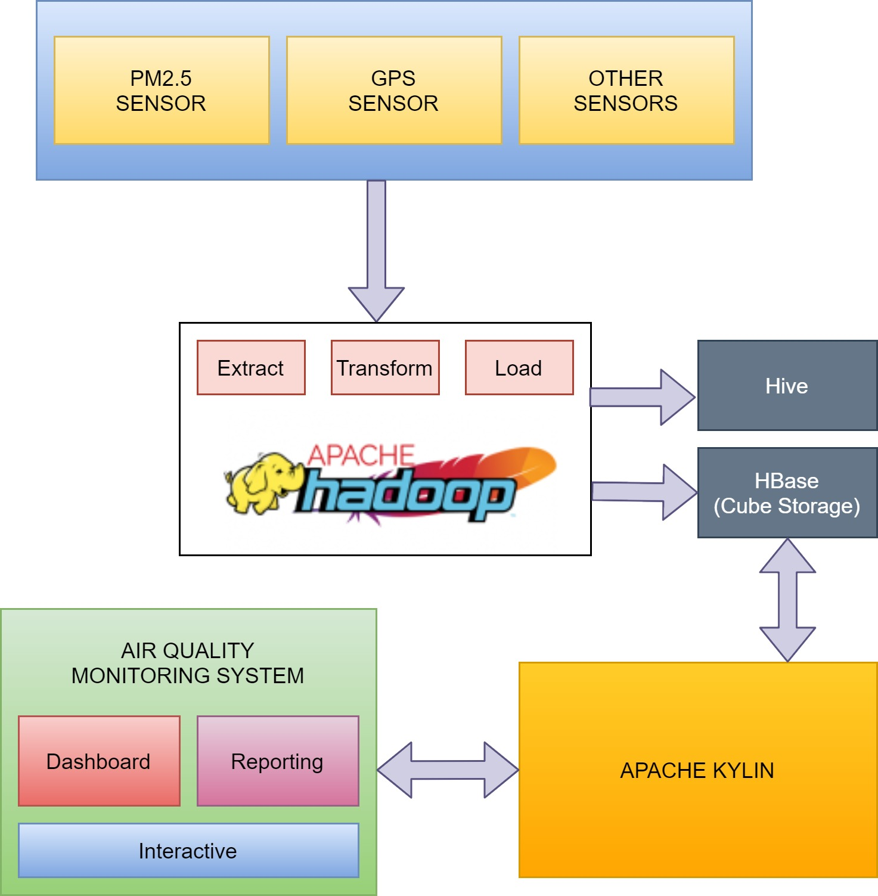

># GROUP 1 : IOT BASED PLATFORM - AIR QUALITY(PM2.5) MONITORING SYSTEM

> Group Members:

>>  1. Smrity Baral (st121662)
>>  2. Shubhangini Gontia (st121473)
>>  3. Suyogya Ratna Tamrakar (st121334)
>>  4. Younten Tshering (st121775)

Air Quality is a big question in these times and to make a system to reduce the air pollution we are looking forward to an air quality monitoring system. This system will be taking the data from sensors such as PM2.5.

Our motive for this project is to analyze the air quality data from the sensor and give a clear vision in a way of dashboard. Therefore, we are going to develop the web app which will show all the required details related to air quality and accordingly people can take preventive measures.

Air Quality is a big question in these times and to reduce the air pollution,  we are looking forward to making an air quality monitoring system. This system will be taking the data from sensors such as PM2.5.
This web application will be using Hadoop and Apache Kylin as a backend to hold a huge amount of  data from sensors and they will be processed with BI tools and different important insights are visualized using an interactive dashboard. As of now, we will be starting with Java Spring Boot framework for developing the system.

>## Architecture diagram

