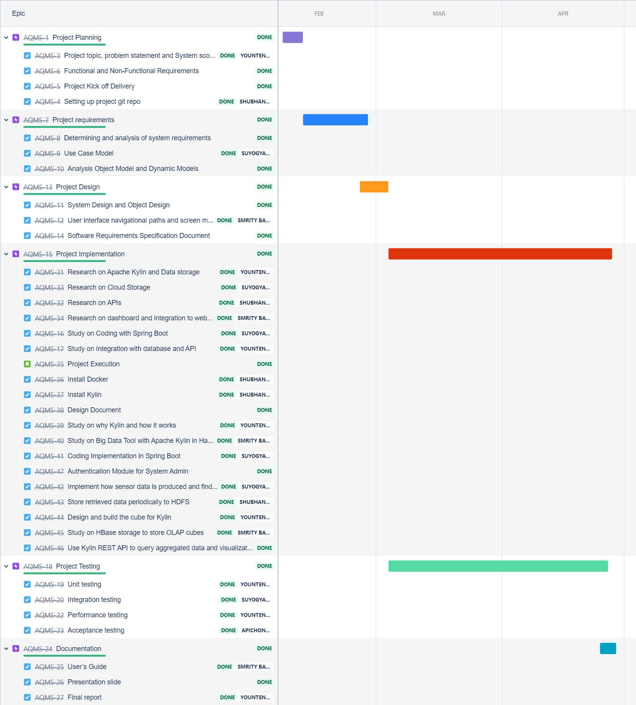
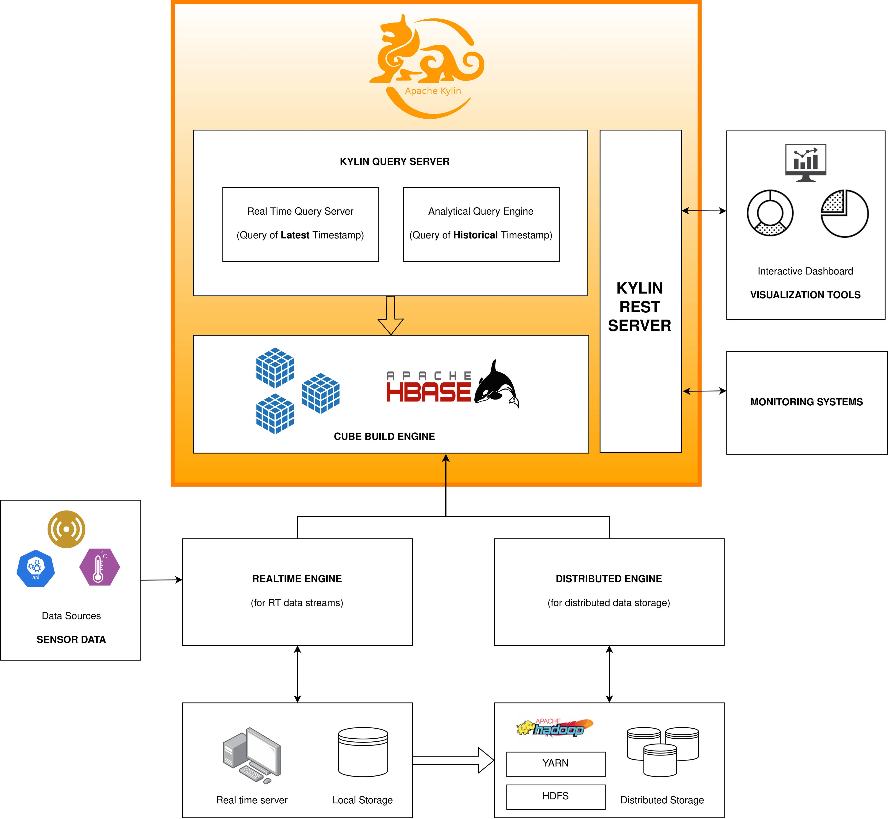

># **GROUP 1 : IOT BASED PLATFORM**

>##  _Group Members_:
> 1. Smrity Baral (st121662)
> 2. Shubhangini Gontia (st121473)
> 3. Suyogya Ratna Tamrakar (st121334)
> 4. Younten Tshering (st121775)
##  **_AIR QUALITY(PM2.5) MONITORING SYSTEM_**

*In this contemporary environment air pollution or air quality have become a big concern as the quality is degrading exponentially. One of which is the PM2.5 crisis where the size of particles is directly linked to their potential for causing health problems. Fine particles (PM2.5) pose the greatest health risk. These fine particles can get deep into lungs and some may even get into the bloodstream. Exposure to these particles can affect a person's lungs and heart.*

*Our motive for this project is to **analyze the air quality data from the sensor** and give a clear vision in a way of dashboard. Therefore, we are going to d**evelop the web app which will show all the required details** related to air quality and accordingly people can take preventive measures.
This web application will be **using Hadoop and Apache Kylin as a backend to hold a huge amount of  data from sensors** and they will be processed with BI tools and different important insights are visualized using an interactive dashboard. As of now, we will be starting with Java Spring Boot framework for developing the system.*

>### _**Work Break Down**_

`Progression table:`

| Activities | Remarks  |
| :----| :--: |
| 1. Project Planning|   |
| 1.1. Project topic, problem statement and System scope | Done |
| 1.2. Functional and Non-Functional Requirements | Done |
| 1.3. Project Kick off Delivery | Done |
| 1.4. Setting up project git repo | Done |
| 1.5. Background study on architecture and design patterns | Done |
| 2. Project requirements |  |
| 2.1. Determining and analysis of system requirements| Done| 
| 2.2. Use Case Model  | Done |
| 2.3. Analysis Object Model and Dynamic Models | Done |
| 2.4. One series of mockups for one use case.  | Done|
| 2.5. Risk and mitigation plan | Done |
| 2.6. Software requirements document. | Done |
| 3. Project Design |  |
| 3.1. Architectural Design | Done |
| 3.2. System Design and Object Design | Done |
| 3.3. User interface navigational paths and screen mock ups | Done |
| 3.4. Software Requirements Specification Document	| Done |
| 4. Implementation  |  |
| 4.1.  Research on Apache Kylin and Data storage |  Done |
| 4.2.  Research on Cloud Storage | Done |
| 4.3.  Research on APIs| Done |
| 4.4.  Research on dashboard and integration to web app | Done |
| 4.5. Coding | progress |
| 4.6.  Integration with database | progress |
| 5. Testing |  |
| 5.1.  Unit testing  | progress  |
| 5.2.  Integration testing |  |
| 5.3.  Performance testing |  |
| 5.4.  Stress testing |  |
| 5.5.  Acceptance testing |  |
| 5.6.  Testing Documentation | progress |
| 6. Documentation |  |
| 6.1.  User’s Guide  |  |
| 6.2.  Presentation slide |  |
| 6.3.  All updated Design, Testing documents (Final report) | progress  |
>## *For more details on work plan follow our link in jira:*

https://sqdi2021g1.atlassian.net/secure/RapidBoard.jspa?rapidView=4&projectKey=AQMS

>## *Our System Architecture*

For more details on implementation follow our link:

https://github.com/shubhanginigon/SDQI2021_G1